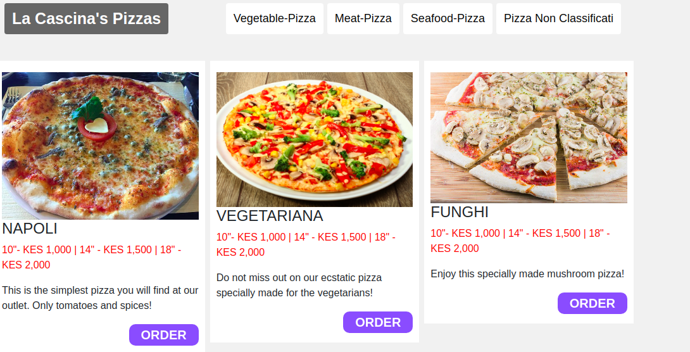

# {La Cascina's Pizza}
#### {La Cascina's pizza is a web application that enables clients to order their favourite pizzas and have them delivered at their addresses.}, {2019}
#### By **{Emma Mwanza}**
## Description
{The web application provides promotional content about the servicespizza La Cascina's offers. Once a client has customised their pizza, their order is processed and then delivered.}

## Screenshot

## Setup/Installation Requirements
Open https://github.com/enm-lab/pizza. On the top right corner of your screen, you should see a button with the text 'Fork'.
Clicking on this button should start the process of copying the project/repository to your own account.Click on that button which should result in a modal prompting you to choose the account to which you want to fork.
Select your account name which should take you to the repo you forked in your account. For example, if your GitHub username is 'enm-lab', you should select it and not anything else that appears in the modal. This may take a couple of seconds so be patient as the process takes place.
To know that the forking process is complete, check the top left corner of your repo. You should be in your account in a repo with the same name as the original repository. This shows that the forking process is complete.
Having copied the repo to your own account, you can then proceed to clone it.Run the git clone command to clone the repo to your preferred location.
Navigate to inside the cloned repository by using the change directory (cd) command.
Open your editor by using the command atom . for Atom users or code . for Visual Studio Code users.
You are now ready to inspect and make modifications to the project.

## Known Bugs
{There are no known bugs to this web application }
## Technologies Used
1. HTML
2. CSS
3. JAVASCRIPT
4. JQUERY
5. BOOTSTRAP
## Support and contact details
{In case, you run into an error please contact us via the contact me via stringmwanza@gmail.com.}
### License
*{MIT License

Copyright (c) 2019 Emma Mwanza

Permission is hereby granted, free of charge, to any person obtaining a copy
of this software and associated documentation files (the "Software"), to deal
in the Software without restriction, including without limitation the rights
to use, copy, modify, merge, publish, distribute, sublicense, and/or sell
copies of the Software, and to permit persons to whom the Software is
furnished to do so, subject to the following conditions:

The above copyright notice and this permission notice shall be included in all
copies or substantial portions of the Software.

THE SOFTWARE IS PROVIDED "AS IS", WITHOUT WARRANTY OF ANY KIND, EXPRESS OR
IMPLIED, INCLUDING BUT NOT LIMITED TO THE WARRANTIES OF MERCHANTABILITY,
FITNESS FOR A PARTICULAR PURPOSE AND NONINFRINGEMENT. IN NO EVENT SHALL THE
AUTHORS OR COPYRIGHT HOLDERS BE LIABLE FOR ANY CLAIM, DAMAGES OR OTHER
LIABILITY, WHETHER IN AN ACTION OF CONTRACT, TORT OR OTHERWISE, ARISING FROM,
OUT OF OR IN CONNECTION WITH THE SOFTWARE OR THE USE OR OTHER DEALINGS IN THE
SOFTWARE.
}*
Copyright (c) {2019} **{Emma Mwanza}**